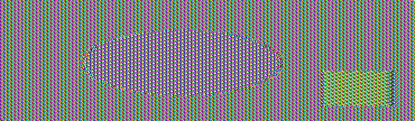

# Crypto II Writeup

Name: Lawrence Byun
Section: 0101

I pledge on my honor that I have not given or received any unauthorized
assistance on this assignment or examination.

Digital acknowledgement: Lawrence Byun

## Assignment Writeup

### Part 1 (70 Pts)

CMSC389R-{m3ss@g3_!n_A_b0ttl3}

### Part 2 (30 Pts)

 

1) CBC image is all static while you can make out the outline of the image for the ECB image.

2) ECB is less secure because it does not have an initialization vector that XOR's the plaintext. With ECB, if you encrypt the the same message, with the same key, you will get the same ciphertext. CBC take care of this by having a random IV that XOR's the plaintext and takes the previous ciphertext and XOR's the next plaintext.
